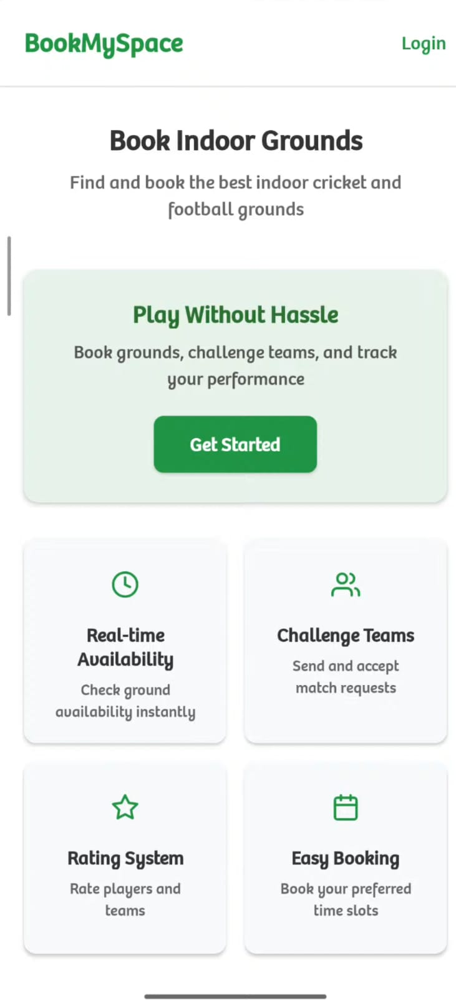
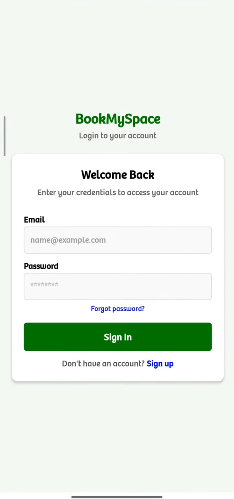
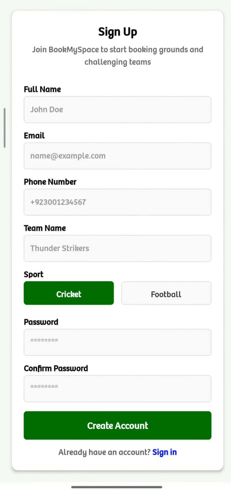

# 🏏 BookMySpace

**BookMySpace** is a **React Native mobile application** that simplifies booking for indoor sports grounds such as **cricket** and **football**.  
Users can browse available venues, view details, book time slots, and manage their reservations — all from one convenient app.

---

## 🚀 Features

- 📅 **Ground Booking:** Easily book available time slots for cricket and football grounds.  
- 👥 **User Accounts:** Sign up, log in, and manage your bookings securely.  
- 🏟️ **Ground Details:** View information and images of each ground.  
- 🔔 **Notifications:** Get updates about bookings and confirmations.  
- 💳 **Simple UI:** Clean, modern design for smooth navigation and usability.

---

## 🛠️ Tech Stack

| Layer | Technology |
|-------|-------------|
| **Frontend** | React Native |
| **Backend** | Node.js with Express.js |
| **Database** | MySQL |
| **API Communication** | RESTful APIs |
| **State Management** | React Hooks & Context API |

---

## 📸 Screenshots

Below are some screenshots of the **BookMySpace** app showcasing its clean UI and smooth functionality:

### 🏠 Home Screen  


### 📅 Booking Screen  


### 🏟️ Ground Details  


### 👤 User Profile  


### 🔔 Notifications  


---

## ⚙️ Installation & Setup

```bash
# 1️⃣ Clone the repository
git clone https://github.com/fatehmuhammad22/BookMySpace.git

# 2️⃣ Navigate to the project directory
cd BookMySpace

# 3️⃣ Install dependencies
npm install

# 4️⃣ Run the app
npx react-native run-android
# or
npx react-native run-ios
